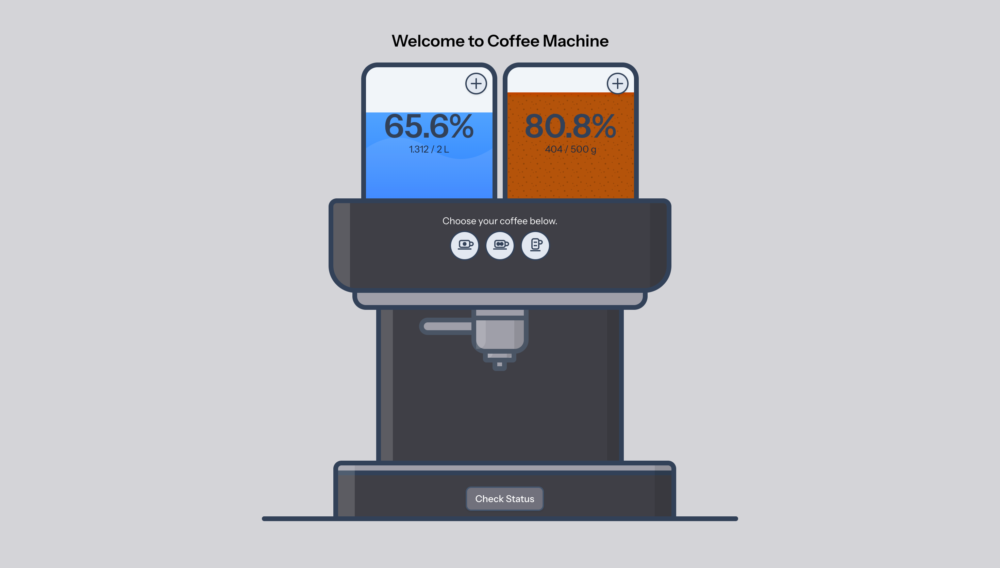

# Blueshores Coffee Machine Challenge



## Laravel 12 + Vue 3 application.

**Demo:** [coffee.pjsalita.com](https://coffee.pjsalita.com)

**Postman collection:** [Coffee Machine API.postman_collection.json](Coffee%20Machine%20API.postman_collection.json)

## Requirements

- Docker & Docker Compose
- PHP 8.3+
- Composer
- Node.js 24+

---

## Setup

### Clone repository

```bash
git clone git@github.com:pjsalita/laravel-vue-challenge.git
```

### Docker

1. Copy environment file:
   ```bash
   cp .env.example .env
   ```
2. Generate app key:
   ```bash
   docker compose run --rm app php artisan key:generate
   ```
3. Build and start the app:

   ```bash
   docker compose up -d --build
   ```

4. Run migrations and seeders:

   ```bash
   docker exec app php artisan migrate --seed
   ```

5. (Optional) Stop the app once finished:
   ```bash
   docker compose down
   ```

### Local (without Docker)

1. Install dependencies and setup:
   ```bash
   composer install
   cp .env.example .env
   php artisan key:generate
   php artisan migrate --seed
   php artisan storage:link
   npm install
   npm run build
   ```
   Or use the composer script:
   ```bash
   composer run setup
   ```
2. Run the dev server:

   ```bash
   composer run dev
   ```

   Or separately: `php artisan serve` and `npm run dev` (in another terminal).

App is available at http://localhost:8000

---

## Configuration

**MACHINE_STATE_STORAGE** – How the coffee machine state is persisted. Set in `.env`.

- `database` (default) – state stored in the database
- `file` – state stored in a file
- `cache` – state stored via Laravel cache
- `redis` – state stored in Redis

---

## Assumptions

1. **Containers start empty.** Containers begin at 0.
2. **Ristretto is not exposed as an endpoint.** Ristretto is listed under Coffee machine requirements but is not listed in the API/UI requirements. Assuming this is a requirement forgot to add in the other parts of the documentation, already prepared the code for it to add later on.
3. **No authentication.** Out of scope for this assessment.
4. **ContainerInterface interface name.** The provided `ContainerInterface.php` file uses `interface Container` which violates PSR-4 Autoloading Standard. Assuming this is a mistake, changed it to `interface ContainerInterface` to comply.
5. **Ports in docker-compose.** Default ports of `Redis(6379)` and `Mysql(3306)` are changed in `docker-compose.yml` to uncommon ports `6400` and `3310` respectively in case the default ports are already in used to avoid conflict. In case of conflict, change to another port or stop other services that uses the conflicting ports.
6. **Check Status inclusion.** "Check the status of the machine" requirement does not cite specifically what data to return, assumed container states and which drink can be brewed.
7. **More drink/coffee types will be available in future.** Assumed that there will be more drink/coffee types to be added in the future so I had them save as records.
8. **Max decimal places** Figures are rounded up to 3 decimal places.
9. **Container resizing is supported by the constructors** Not exposed as a runtime API — the spec says "other sizes can be attached" implying a physical swap, not a live API call.

---

## References

- Machine UI: https://codepen.io/jenningscreate/pen/pdMMZJ
